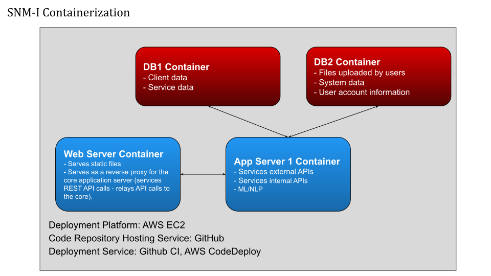

import FileTree from '../../components/file-tree.astro';

The project consists of a website as the frontend and a server with databases as the backend.
The frontend code contains the routing of the pages and the layout of each page,
but the actual content such as the list of users, services,
and **the options of the dropdown menus and forms are dynamically loaded from the backend**
using [our internal APIs](/guides/api/).

## Architecture
The frontend contains the code that calls the APIs to create/read/update/delete these data,
and the backend contains the routing of these APIs and their handlers.
Here is an illustration of the overall architecture:

Zooming in on the backend, we have the following architecture:

As the backend receives an API request sent from the frontend,
if the corresponding hanlder routed to the API is one of the public services,
the server runs the handler, which may query MongoDB, and sends a respond back to the frontend.
Otherwise, it is a private function and the server attempts to authenticates
and authorizes the user before proceeding.
Only after authorizing the user does the server run the dedicated handler,
which then queries the data storage systems.

## File tree
This section contains a summary of what each directory is for to help you
navigate and search for the relevant files.

### Frontend
<FileTree>
- frontend/src/
    - App.js the top React component
    - index.js main entry of the React app
    - routes.js react routers (contains paths to all of the subpages in the website)
    - api/  methods to make API calls to the backend
    - **components/** **contains the bulk of components that render all subpages**
        - shared/ frequently reused components such as alert dialogs and link buttons
    - constants/ frequently reused objects for field population and message strings for blur
    - context/ defines the context object and its getter that tracks the global state
    - helpers/ functions to verify correctness of fields; defines verification error messages and regex to check correctness of entries
    - store/
        - actions/ no longer used as we use React hooks and not Redux
        - reducers/ no longer used as we use React hooks and not Redux
        - reducers.js no longer used as we use React hooks and not Redux
        - defaults.js config for the backend address
    - styles/ css for client and provider tables
</FileTree>

### Backend
<FileTree>
- backend/
    - app.js the main function of the backend (loads the express app)
    - bin/
        - www the starting script for the backend
    - config/
        - index.js contains host/port configs for graphdb, mongodb, and frontend
        - cert.pem required for hosting the http server
        - key.pem required for hosting the http server
    - loaders/ contains the express, graphdb, and mongodb functions called on startup
    - models/ defines the graphdb and mongodb data models
    - routes/ defines the api routes and binds them to corresponding function in services/
    - **services/** **core logic of the backend**
    - utils/ contains the abstract grpahdb model which defines methods that sends queries to the db
</FileTree>

## Putting everything together
This section will give a brief overview of each component of the application work
together to give a general understanding of what each component does, its role
in the application, and the components it depends on or is the dependant of.

### Frontend
When you visit any URL on the SNM-I domain or localhost on your browser, the
React app renders the base component `frontend/src/App.js` and
`frontend/src/index.js`, and takes the path and replaces the content of the
current page with the matching component defined in `frontend/src/routes.js`.
This is a technique for single-page apps (SPA), where the app only has one
page, and only re-renders the changing components on page navigation.

For example, visiting `localhost:3000/login` loads the `LoginPane` component,
defined in `frontend/src/components/LoginPane.js`.
The bulk of the frontend is in this `frontend/src/components` directory.
Components such as forms, dashboards, and form fields are modularized into
reusable components and routed to URLs in `frontend/src/routes.js`.

Within `frontend/src/components/`, there is a sub-directory `shared/` for the
components that are reused within the components, such as alert dialogues and
link buttons.

As you navigate and interact with the page, sometimes you may run into error
messages or help texts such as "This field is required".
These texts are factored out in `frontend/src/constants/` and reused in
`frontend/src/components/`.

Some information are the same regardless of which page you are on, such as
whether you are an admin user. Whether the user is an admin significantly
affects which functionalities should be loaded on the page. For example, we
don't want to let a non-admin user see a form that can edit other users
(they won't be able to use the form anyway since the backend would not authorize it).
Therefore, these information are factored out in `frontend/src/contexts/index.js`,
where the global states are tracked.

The components in `frontend/src/components/` make use of all these constants,
contexts, as well as helper methods in `frontend/src/helpers/` and style sheets
in `frontend/src/styles/`.

### Backend
The backend serves the API endpoints that connect the frontend to certain
functionalities. When the frontend makes requests to an API, the backend
performs some action and optionally sends back some data. These actions are
defined in `backend/services/`, which is where the core logic of the backend is.
`backend/routes/` then maps the self-defined API endpoints to these functions.
For example, `backend/routes/base.js` routes `/api/login` to the `login`
function, defined in `backend/services/userAccount/auth.js`. For a complete list
of the API routes and their associated function, please see the [API guide](/guides/api/).

When you run `yarn start` in the backend, it runs `backend/bin/www`, which
starts a local server and runs the main script `backend/app.js`,
which then loads the databases GraphDB and MongoDB using the loaders defined in
`backend/loaders/`, as well as Express.js which serves the API routes in `backend/routes/`.

All the APIs involve some interactions with either MongoDB, which stores all
user-related information, or GraphDB, which stores the rest of the information
such as forms and services.
When the backend receives an API call from the frontend, it queries the database(s)
using the helper utilities in `backend/utils/`, discussed in more details in
the [GraphDB utils guide](/guides/graphdb-utils/), and assumptions of the data
models defined in `backend/models/`, discussed in more details in the [Data
model guide](/guides/data-model/).
