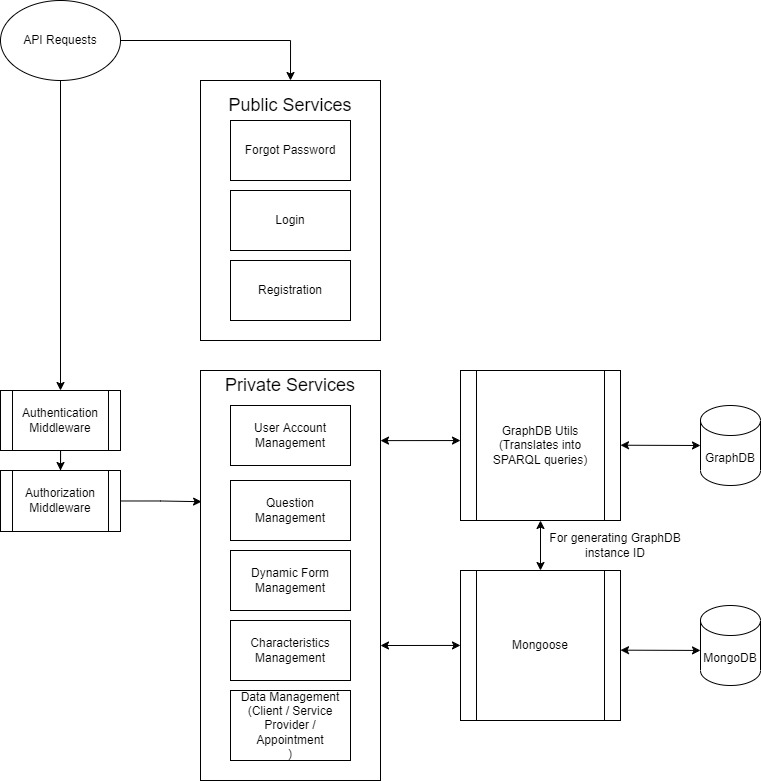

import FileTree from '../../components/file-tree.astro';

## Overview

**Frontend:**
The frontend portion of the application is a website (using React) to be operated by the user. The code included in the frontend 
directory contains the routing of the application's pages and the general layout of each page. 
user sessions and page content (e.g. the list of users, services, forms, and drop-down menu options)
are gathered from the backend via API requests.

**Backend**
The backend portion of the application is a server (ExpressJS) that handles API requests from the users on the frontend 
application. Depending on the API request, the server application will access its databases (MongoDB and GraphDB), complete the request, 
and return any necessary information back to the user. You may consult [our internal API documentation](/guides/api/)
for more information.

## Architecture

The frontend contains code to make API calls. Upon use, the user may wish to create, read, update, or delete data stored in the backend.
On the other hand, the backend server routes API calls and their handlers.

Below, you may find a diagram of the overall architecture:

For the handling of specific API calls, the backend can be illustrated by the following diagram:

**Summary of the API system:**
1. The backend server receives an API request sent by the user through the frontend application.
2. Depending on the request, the API call is routed to one of two handlers: public services, or private functions:
* Public Services:
This handler queries the MongoDB database and sends a response back to the frontend.
* Private Functions:
Before invoking this handler, the server will first attempt to authenticate and check the authorization of the user before any operations are executed.
Only after the user is authenticated and has authorization for the requested operation will the handler be run, which queries either the MongoDB or GraphDB Databases.  

## File tree
This section serves as a summary of the overarching file system for the frontend and backend source code.

### /frontend
<FileTree>
* /frontend/src/:
    * App.js: The top React component
    * index.js: The main entry of the React app
    * routes.js: React routers, these contain the paths to all website subpages
    * api/: A directory of JavaScript files with methods to make API calls to the backend server
    * **components/:** **A directory of components used to render subpages**
        * shared/: A subdirectory of components that are frequently re-used in subpages. Examples include alert dialogs and link buttons.
    * constants/: A subdirectory of frequently reused JavaScript objects used for field population and message strings in forms.
    * context/: Defines the context object used for storing the current user's profile. Additionally contains the object's getter function that tracks its global state.
    * helpers/: Contains various function for field verification in forms. This section also defines verification error messages and regex strings to check the correct formatting of user input.
    * store/:
        * actions/: **DEFUNCT**, React hooks have been used instead of Redux
        * reducers/: **DEFUNCT**, React hooks have been used instead of Redux
        * reducers.js  **DEFUNCT**, React hooks have been used instead of Redux
        * defaults.js A config file for the backend address
    * styles/: CSS styling for client and provider tables
</FileTree>

### /backend
<FileTree>
* backend/:
    * app.js: The main function of the backend (loads the ExpressKS app)
    * bin/:
        * www: The starting script for the backend
    * config/:
        * index.js: Contains host/port configs for graphdb, mongodb, and frontend
        * cert.pem: Required for hosting the http server
        * key.pem: Required for hosting the http server
    * loaders/: Contains the express, graphdb, and mongodb functions called on startup
    * models/: Defines the graphdb and mongodb data models
    * routes/: Defines the api routes and binds them to corresponding function in /services
    * **services/:** **Core logic of the backend**
    * utils/: Contains the abstract grpahdb model which defines methods that sends queries to the db
</FileTree>

## Summary
This section provides a brief overview of how components of the application work
together. General descriptions of each components' function/role and its dependencies can
be found here.

### Frontend
When you visit any URL on the SNM-I domain or localhost on your browser, the
React app renders the base component `frontend/src/App.js` and
`frontend/src/index.js`. The React app then takes the URL path to replaces the content of the
current page with the matching component defined in `frontend/src/routes.js`.
This is a technique for single-page apps (SPA), where the app only has one
page. Only components that need to be changed are re-rendered upon page navigation.

As an example, consider a scenario where the user is visiting `localhost:3000/login`.
This loads the `LoginPane` component defined in `frontend/src/components/LoginPane.js`.
Note that the bulk of the frontend application is in the `frontend/src/components` directory.
Components such as forms, dashboards, and form fields are modularized into
reusable components and routed to URLs in `frontend/src/routes.js`.

Within `frontend/src/components/`, there is a sub-directory named `shared/`.
This holds components that are commonly reused among subpages. Examples include alert dialogues and
link buttons.

As you navigate and interact with the page, you may run into error
messages or help texts such as "This field is required".
These texts are frequently reused throughout the frontend application and are kept in `frontend/src/constants/`.
Error messages such as these can then be easily referenced and reused by components in `frontend/src/components/`.

Based on the permission level of the user, the content and functionality of each page
may be significantly different. For example, non-admin users should are unable to view
forms that can edit another user's data. Functionality is also further prevented by the backend
application as the non-admin user does not have authorization. The visibility of information instead
considered in `frontend/src/contexts/index.js`, where global states are tracked.

Overall, components in `frontend/src/components/` make use of the previously-mentioned constants,
contexts, helper methods in `frontend/src/helpers/`, and style sheets
in `frontend/src/styles/`.

### Backend
The backend is responsible for providing the API endpoints that establish connections 
between the frontend and specific functionalities. When the frontend makes requests to an API, 
`backend/routes/` maps the self-defined API endpoints to the user's requested action.
The backend performs the required actions (and may return data back to the user depending
on the request) through the defined functions in `backend/services/`.

As an example, `backend/routes/base.js` routes `/api/login` to the `login`
function defined in `backend/services/userAccount/auth.js`. For a complete list
of API routes and their corresponding function, refer to the [API guide](/guides/api/).

When you run `yarn start` in the `backend/` directory, the `backend/bin/www` file is ran.
This starts a local server and runs the main script `backend/app.js`. Using the loader
scripts in `backend/loaders/`, the GraphDB and MongoDB databases are loaded.
The backend ExpressJS server then serves the API routes defined in `backend/routes/`.

All API requests involve interactions with either the MongoDB or GraphDB databases.
The MongoDB database stores all user-related information, meanwhile the GraphDB database
stores the rest of the backend's information, like forms and services.
When the backend receives an API call from the frontend, it queries the database(s)
using the helper utilities in `backend/utils/`. This is discussed in more detail in
the [GraphDB utils guide](/guides/graphdb-utils/). For more details on the assumptions of the data
models defined in `backend/models/`, refer to the [Data model guide](/guides/data-model/).
